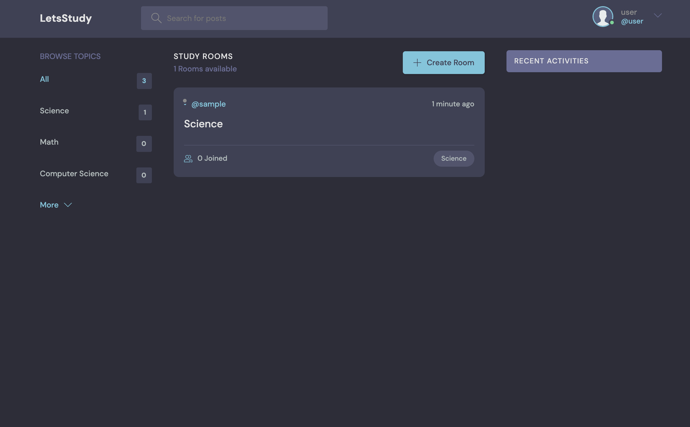
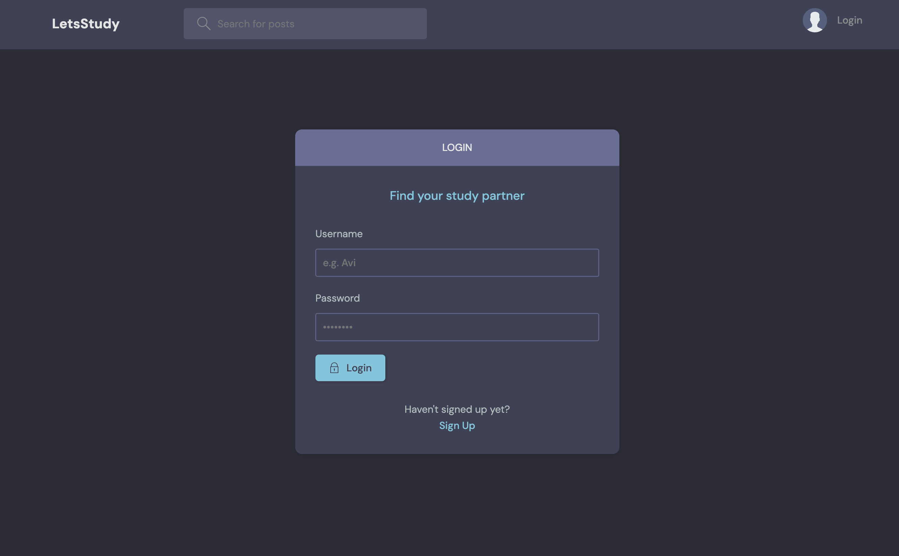
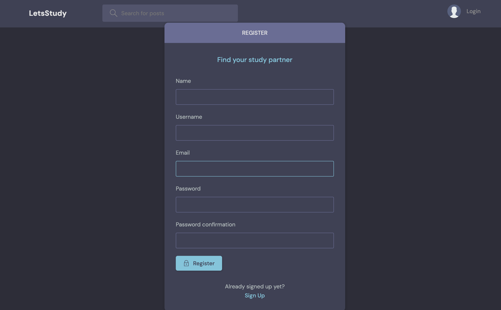
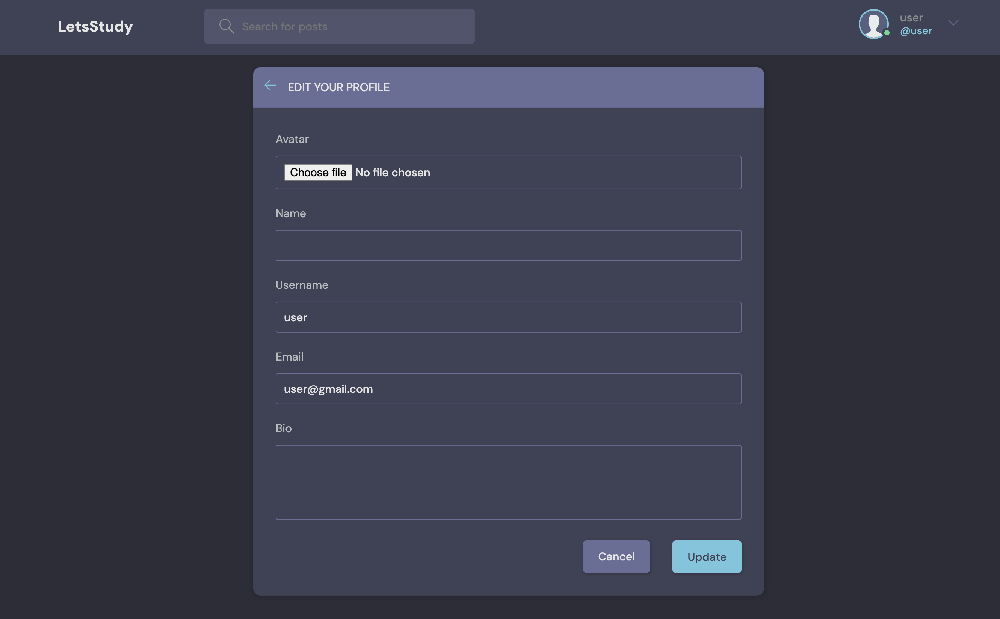
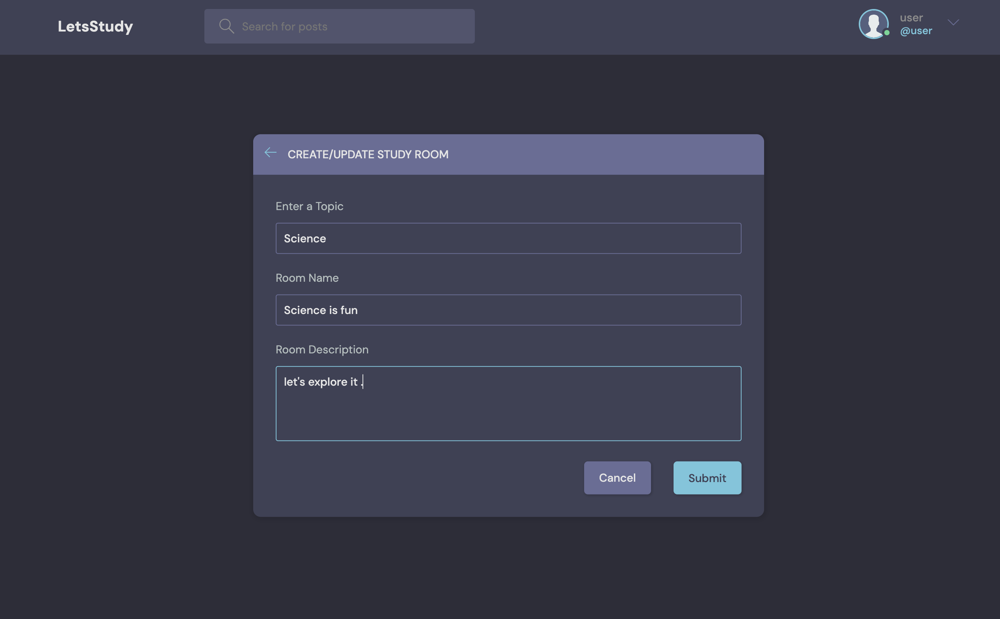
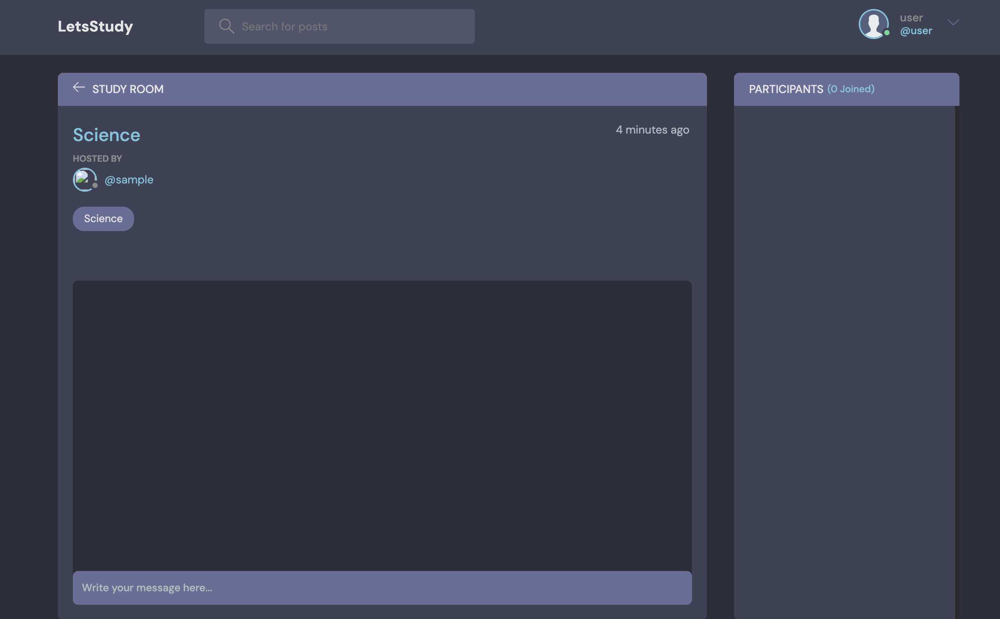
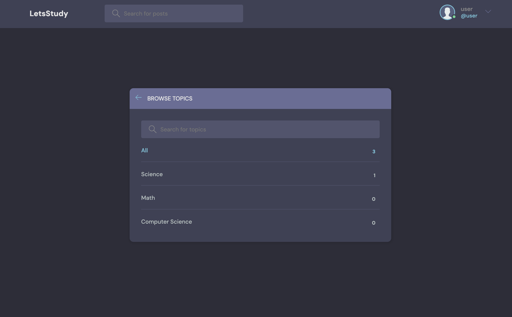

# lets_Study

## Overview

**lets_Study** is a Django-powered platform designed to connect students for collaborative learning and study group formation. The platform enables users to create and join study groups, schedule study events, and manage their profiles, providing a seamless environment for academic collaboration.

## Features

- **User Authentication**: Secure login and registration system with password management.
- **Profile Management**: Users can create and update their profiles, including personal information and academic interests.
- **Study Groups**: Create, join, and manage study groups based on subjects, topics, or interests.
- **Event Scheduling**: Schedule study sessions and events within groups, with notifications for upcoming events.

## Tech Stack

- **Django**: Backend framework used for rapid development and clean, pragmatic design.
- **HTML/CSS/JavaScript**: Frontend technologies for creating responsive and user-friendly interfaces.
- **PostgreSQL**: Relational database management system used for storing user data, study groups, and events.

## Screenshots

Here are some screenshots of the key pages in the **lets_Study** platform:

### Home Page


### Login Page


### Registration Page


### Profile Page


### Room Page


### Room Chat


### Topic Page


## Installation

To run this project locally, follow these steps:

1. **Clone the repository:**

   ```bash
   git clone https://github.com/yourusername/lets_study.git
   cd lets_study
   ```

2. **Create and activate a virtual environment:**

   ```bash
   python -m venv venv
   source venv/bin/activate  # On Windows: venv\Scripts\activate
   ```

3. **Install dependencies:**

   ```bash
   pip install -r requirements.txt
   ```

4. **Set up the PostgreSQL database:**

   - Create a PostgreSQL database and update the `DATABASES` settings in `settings.py`.

5. **Apply migrations:**

   ```bash
   python manage.py migrate
   ```

6. **Run the development server:**

   ```bash
   python manage.py runserver
   ```

   Visit `http://localhost:8000` in your browser to see the application in action.

## Usage

- **Sign Up**: Create an account to start using the platform.
- **Create or Join Study Groups**: Browse or search for study groups based on your interests, or create your own.
- **Manage Profile**: Update your personal information and academic interests in your profile.
- **Schedule Events**: Create and manage study sessions or events within your groups.

